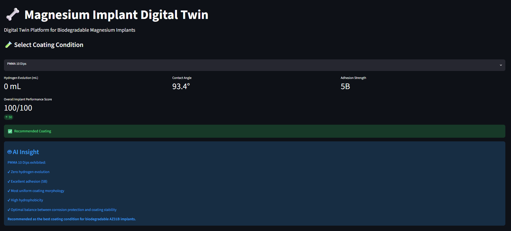
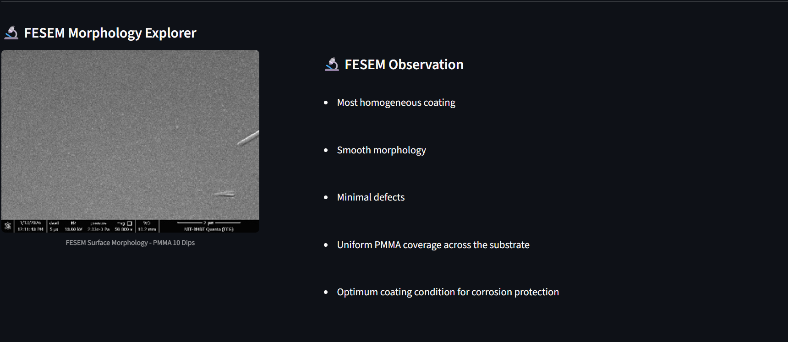
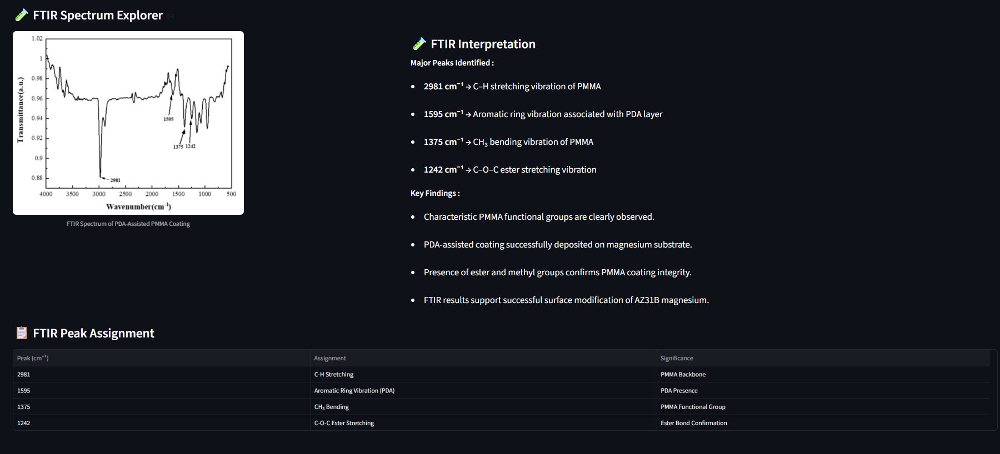
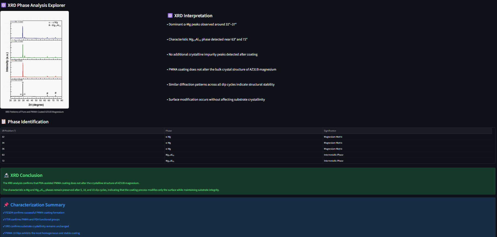

# 🦴 Magnesium Implant Digital Twin

🚀 **Live Demo:** https://magnesiumimplantdigitaltwin-96wkxuah2fmz2pbkhphhux.streamlit.app/

Digital Twin platform for biodegradable magnesium implants integrating corrosion analysis, FESEM morphology, FTIR characterization, XRD phase analysis, and AI-assisted implant suitability prediction.

### Digital Twin Platform for Biodegradable Magnesium Implants

An interactive Streamlit-based Digital Twin framework developed for evaluating biodegradable magnesium implant coatings using experimental corrosion, wettability, adhesion, FESEM, FTIR, and XRD characterization data.

The platform integrates material characterization with data analytics to recommend the most suitable coating condition for biomedical implant applications.

---

## 🚀 Key Features

✅ Hydrogen Evolution Analysis

✅ Contact Angle & Wettability Assessment

✅ Adhesion Strength Comparison

✅ Implant Performance Ranking

✅ Digital Twin Recommendation Engine

✅ FESEM Morphology Explorer

✅ FTIR Spectrum Interpretation

✅ XRD Phase Analysis

✅ AI Corrosion Prediction

✅ Implant Suitability Radar Chart

✅ Automated Implant Assessment Report

---

# 📊 Dashboard Overview

## Main Dashboard



---

## Hydrogen Evolution & Contact Angle Analysis


---

## Adhesion Ranking & Digital Twin Recommendation


---

## FESEM Morphology Explorer



---

## FTIR Spectrum Analysis



---

## XRD Phase Identification



---

## Implant Suitability Radar Chart


---

# 🔬 Experimental Conditions

### Samples Investigated

| Sample | Description |
|----------|-------------|
| Pure Mg | Uncoated Magnesium |
| PMMA 5 Dips | PMMA-coated Magnesium |
| PMMA 10 Dips | PMMA-coated Magnesium |
| PMMA 15 Dips | PMMA-coated Magnesium |

---

# 🧪 Characterization Techniques

### FESEM
Surface morphology evaluation of coated and uncoated magnesium samples.

### FTIR
Identification of PMMA functional groups and coating confirmation.

### XRD
Phase identification and structural stability analysis.

### Contact Angle
Wettability and surface hydrophobicity assessment.

### Hydrogen Evolution
Corrosion performance evaluation in simulated physiological conditions.

---

# 🤖 Digital Twin Logic

The Digital Twin framework combines:

- Corrosion Resistance
- Wettability
- Adhesion Strength
- Surface Morphology
- Structural Stability

to generate:

- Implant Performance Score
- Corrosion Risk Prediction
- Coating Recommendation
- Implant Suitability Assessment

---

# 🏆 Key Findings

### PMMA 10 Dips

✔ Highest overall implant performance

✔ Excellent corrosion resistance

✔ Balanced hydrophobicity

✔ Strong coating adhesion

✔ Best suitability for biodegradable implant applications

---

# 🛠 Technology Stack

- Python
- Streamlit
- Pandas
- NumPy
- Plotly
- Materials Characterization Data

---

# 📂 Repository Structure

```text
Magnesium_Implant_Digital_Twin/
│
├── app.py
├── requirements.txt
├── README.md
│
├── data/
│
├── images/
│   ├── FESEM/
│   ├── FTIR/
│   ├── XRD/
│   └── screenshots/
│
└── notebooks/
```

# ▶️ Run Locally

```bash
git clone https://github.com/biotech-py/Magnesium_Implant_Digital_Twin.git

cd Magnesium_Implant_Digital_Twin

pip install -r requirements.txt

streamlit run app.py
```

# 📈 Future Scope

- Machine Learning-based Corrosion Prediction
- Real-Time Implant Monitoring
- Patient-Specific Digital Twin Models
- Biomedical Decision Support System
- Cloud-Based Implant Analytics

---

## 👨‍🔬 Author

**Nirupam Joarder**

Biotech | Biomaterials | Data Analytics

